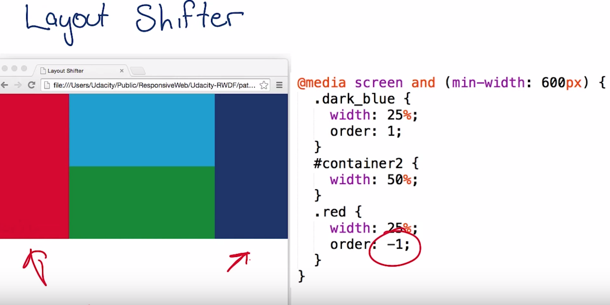
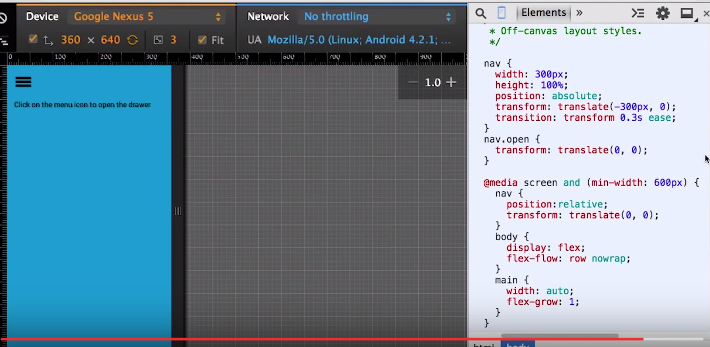

# Udacity RWD
[link](https://www.udacity.com/course/progress#!/c-ud893)
- The viewport and the device pixel ratio are both likely causes for the differences between devices.
-  a device pixel ratio(DPR) of 2 means that there are two hardware pixels for every one CSS pixels.
    +  dpr 2는 하나 CSS pixel마다 2개의 hardware 픽셀이 있다는 말.(css:hd = 1:2)(하드2픽셀이 모여서 css 1픽셀 만듦)
    +  1920*1080px 모바일 스크린이 dpr가 2면 viewport의 css pixel의 max width는 960이다.
- 뷰포트 메타는 꼭 붙이자
```html
<meta name="viewport" content="width=device, initial-scale=1">
```
- img는 크기가 div를 빠져나가면 그냥 빠져나가진다. 그러므로 붙일것은
```css
//100%를 넘지 않도록
img, embed, object, video {
    max-width: 100%;
}

//손가락이 터치할 수 있도록
nav a, button {
    min-width: 48px;
    min-height: 48px;
}
```
- 미디어쿼리
    + min-width: 브라우저 크기
    + min-device-width: 창크기
        * legacy android browser may return wrong value
```html
<link rel="stylesheet" media="screen and (min-width:500px)" href="over500.css">
```
```css
@media screen and (min-width:500px){
    body {
        color:red;
    }
}
```
- flex box
```css
@media screen and (min-width:700px) {
    .dark_blue {order:4;}
    .green {order:5;}
    .red {order:1;}
}

.container {
    display: flex;
    flex-wrap: wrap;
}
```
- Common Responsive Patterns
    + Column Drop
        * col들이 차곡차곡 떨어진다
    + Mostly Fluid
        * 제일 커지면 옆에 마진 생긴다.
        * margin-left: auto; margin-right:auto;
    + Layout Shifter
        * 레이아웃 변하면 col들이 이곳 저곳 움직임
        * .dark_blue{order:4;} .light_blue{order:-1;}
        * 
    + Off Canvas
        * 작아지면 햄버거아이콘으로 쫄아들음
        * 

# NARADesign님의 슬라이드
http://naradesign.net/rwd/pr/#s1
## 모바일 퍼스트
모든 모바일 브라우저가 미디어쿼리를 지원하는 것은 아니다.
```css
@charset "utf-8"; 
/* 모바일용 CSS 코드를 먼저 작성하고 미디어쿼리로 감싸지 않는다 */ 
@media all and (min-width:768px){
    /* 테블릿 해상도 이상의 CSS 코드만 미디어 쿼리 구문 안쪽에 작성한다 */ 
}
```

## 낡은 데탑 브라우저와 미디어쿼리
모든 데탑 브라우저가 미디어쿼리를 지원하는 것은 아니다 ;(
```html
<head> 
<!--[if lt IE 9]> 
<script src="respond.min.js"></script> 
<![endif]--> 
</head>
```

- [respond.min.js](https://github.com/scottjehl/Respond) 라이브러리를 사용하면 IE 6~8 브라우저도 미디어쿼리를 해석할 수 있다. 라이선스: MIT.
    + 로컬 환경에선 동작 X
    + 미디어쿼리 작성시 `all` `and`키워드 생략하면 동작 X
    + 페이지 무거운 경우 미디어쿼리 구문 안쪽 코드가 늦게 표시되어 IE 6~8에서 모바일화면 잠깐 노출될 수 있음.

## IE 8이하와 HTML5
- `html5shiv.js`를 head 요소 내부에 삽입하면 IE 6~8 브라우저도 HTML5 요소를 화면에 표시하게 된다. 라이선스: MIT.
- html5shiv.js 파일을 추가해도 새로운 요소들 때문에 화면이 깨지는 증상을 발견할 수 있다.
이유는 display:block 으로 표시해야 할 블럭 요소들이 display:inline 으로 렌더링 되기 때문.

```css
header,footer,section,article,aside,nav,hgroup,details,menu,figure,figcaption{
  display:block
}
```
- 인라인 형태로 표시되던 새로운 HTML5 요소를 블럭 요소로 변경해 준다. 이제 IE 6~8 브라우저도 HTML5 요소를 화면에 제대로 표시하게 된다.


## ETC
[스매싱북 사달라하기](http://www.smashingmagazine.com/books/#smashing-book-5)
[다국어 사이트를 위한 반응형 디자인 팁 13가지](http://responsivenews.co.uk/post/123104512468/13-tips-for-making-responsive-web-design)
[디자이너가 준 psd아이콘을 웹폰트로 만들기](http://tobyyun.tumblr.com/post/112101781742/%EB%94%94%EC%9E%90%EC%9D%B4%EB%84%88%EA%B0%80-%EC%A4%80-psd%EC%9D%98-%EC%95%84%EC%9D%B4%EC%BD%98%EC%9D%84-%EC%9B%B9%ED%8F%B0%ED%8A%B8%EB%A1%9C-%EB%A7%8C%EB%93%A4%EA%B8%B0)
[반응형웹 해상도 분기점](http://tobyyun.tumblr.com/post/114586252277/%EB%B0%98%EC%9D%91%ED%98%95%EC%9B%B9%EB%94%94%EC%9E%90%EC%9D%B8%EC%9D%98-%ED%95%B4%EC%83%81%EB%8F%84%EB%B6%84%EA%B8%B0%EC%A0%90%EC%9D%80-%EC%96%B4%EB%96%BB%EA%B2%8C-%EB%82%98%EB%88%8C%EA%B9%8C)
[DEVIEW 2012 반응형 웹 구축기](http://naradesign.net/rwd/pr/#s1)
